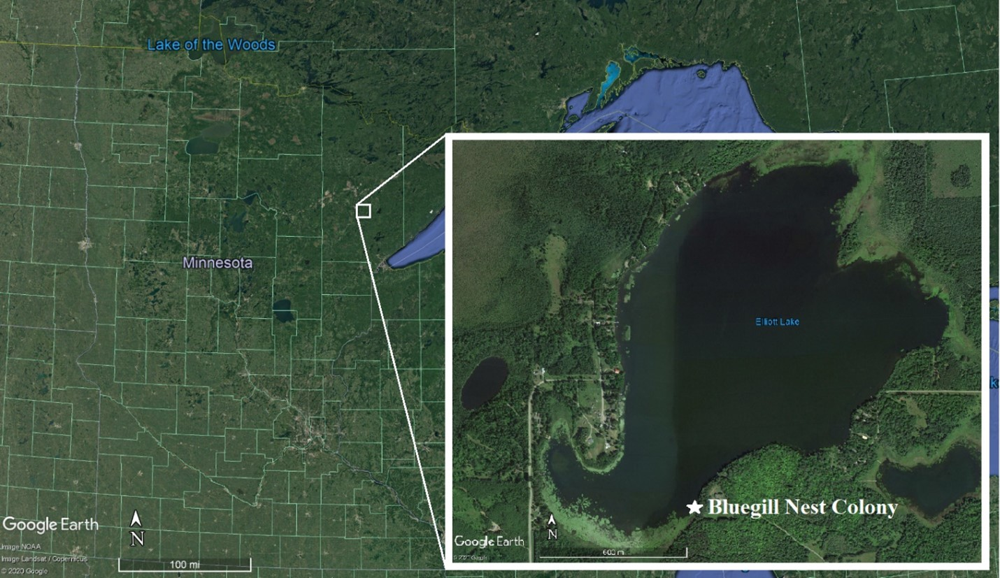
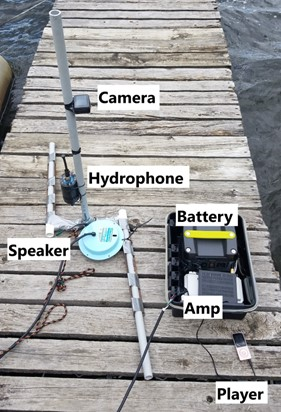
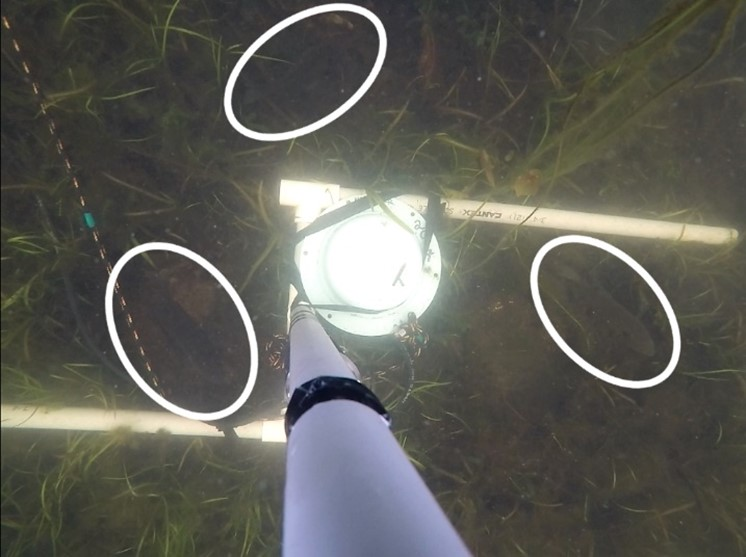

```{r setup1, include=FALSE}

# use https://word2md.com/ to help carry over formatting of references until learn to link reference manager
```

# **Introduction**

Anthropogenic impacts on environments are increasing and includes stressors such as light pollution, habitat loss and fragmentation, climate change, and noise pollution. Habitats are experiencing increasing terrestrial, airline, and shipping traffic with sound from these activities penetrating even remote wilderness areas (Barber et al. 2010). Despite the increase in anthropogenic sound levels in aquatic ecosystems, the effect on aquatic species is relatively unexplored, especially in freshwater (MacLean et al. 2020, Putland & Mensinger 2020, Mickle & Higgs 2018, Mensinger et al. 2018, Nedelec et al. 2017). As many aquatic animals rely on sound for critical functions such as finding mates or food, changes in the natural soundscape due to anthropogenic sound can prevent these animals from effectively completing these critical behaviors on sound for.

There are two main mechanisms that anthropogenic sound can affect animals: decreasing detection of other auditory stimuli and attention shifts. Temporary threshold shifts (TTS) increase auditory thresholds due to inner ear hair cell fatigue (Putland et al. 2019). For example, oyster toadfish (_Opsanus tau_) exposed to even 1-hr of anthropogenic sound had a TTS, and individuals exposed to 12-hrs of sound showed extended hearing loss for 3 days (Rogers et al. 2020). Effects on auditory thresholds vary by species; for example, fathead minnows (_Pimephales promelas_), a hearing specialist, exposed to 2-hrs of boat sound experienced a TTS (Scholik & Yan 2022b). In comparison, no statistically significant threshold change was observed in the bluegill (_Lepomis machrochirus_), a hearing generalist, when exposed to white noise (Scholik & Yan 2022a). Additionally, sound masking prevents the detection of a signal either by overlapping another sound with the same frequency at the same time or by preventing distinction from background noise (Clark et al. 2009; Putland et al. 2019). Anthropogenic sound often has a significant low frequency component between 10 and 1000 Hz which overlaps the common frequency range of biological sounds (Clark et al. 2009).

On the other hand, attention shifts can distract animals and disrupt important behaviors such as foraging (Purser & Radford 2011) or nest vigilance (MacLean et al. 2020). Chronic exposure to increased sound levels indirectly disrupts animals' life histories (Gurule-Small & Tinghitella 2019), and acute exposure can cause changes in foraging behavior, calling behavior, spatial movement patterns, and hearing thresholds of aquatic animals (Shannon et al. 2016). Anthropogenic sound can detrimentally affect stress levels, foraging success, and sheltering response (Mickle & Higgs 2018), and anthropogenic activities such as angling can reduce reproductive success in fish especially if causing nest abandonment (Suski et al. 2003).

There have been varying reports of fish behavioral changes in response to anthropogenic sound across experiments. The response of marine Australian snapper (_Pagrus auratus_) to a motorboat passing depended on whether the individual fish lived in a marine protected area or not which would determine the threat level associated with motorboat sound (Mensinger et al. 2018). Habituation to motorboat sound would be beneficial if it is a nonthreatening sound source; however, if it is associated with the danger of being caught by anglers, then habituation could reduce fitness. In freshwater, while nesting smallmouth bass (_Micropterus dolomieu_) did not change the amount of darting or turning behaviors during boat motor playback, smallmouth bass did decrease residency time on the nest as the speaker was moved closer to the nest, indicating that boats operating near nests may detrimentally affect parental care (MacLean et al. 2020). While studies have examined changes in parental care related to hormone manipulation to simulate stressors (Dey et al. 2010, Zolderdo et al. 2016, Dey) or to boat motor sound playback (MacLean et al. 2020), few have examined responses to physical boat passes of fish caring for their offspring while nesting (Maxwell et al. 2018).

Non-lethal effects from anthropogenic sound can be difficult to quantify. There is especially disconnect when relating fitness changes of an individual to a population level.While there is a need to manage the effect anthropogenic sound has on wildlife, it can be hard to relate reduction in individual fitness to effects at the population level (Mensinger et al. 2018, Mickle & Higgs 2018). Looking at effects during critical life stages such as reproduction can shed light on pivotal effects of anthropogenic disturbance that would be transferable to the population scale.

Bluegills (_Lepomis macrochirus_) are an ideal study species for this examining fitness changes caused by anthropogenic sound as they are an important game fish throughout their range (Gaeta et al. 2013, Pope et al. 2016, Tingley et al. 2019) and exhibit strong paternal care while spawning multiple times a season (Avila 1976, Cooke et al. 2008). After constructing a nest, the male spawns with one or more females, then cares for the offspring by guarding and aerating the eggs (Cooke et al. 2008). Nest rim circling and tail-sweeping were found as the most frequent behaviors of nesting bluegills, and they function to aerate eggs and monitor for predators or intraspecific intruders (Avila 1976). Although, defense and vigilance behaviors, such as turning rate, can vary with predation pressure (Cooke et al. 2008). While these studies give insight into typical bluegill nesting behavior, little is known about how anthropogenic sound affects these behaviors at the critical life stage of spawning, despite the bluegill's frequent exposure to boat sounds as a prominent game fish.

Here, we investigate the effects recreational boating has on the nesting behavior of bluegill. Nesting bluegills were exposed to boat motor playback and passes by a pontoon boat while behavior was recorded via underwater video before, during, and after sound playback. We tested the predictions that 1) the bluegills would temporarily flee from the boat motor stimuli, 2) the bluegills would orient towards the sound during boat motor playback, 3) nesting bluegills would reduce prominent nesting behaviors such as rim circling during stimuli. These predictions investigate differing degrees of response, all with potential for decreased nest vigilance and care. If bluegills experienced TTS, then it would be expected that the behavior changes continued to increase in magnitude with increased exposure (dB level or duration). If behavior changes were caused by sound masking, then it would be expected that the behavior change was constant during stimulus exposure. If behavior changes were a result of an attention shift, then the magnitude of behavior change would be expected to vary with stimulus intensity similar to TTS; however, with an attention shift, the individual could habituate to the stimulus and the behavior change would decrease back to baseline with habituation to the stimulus. For the class project, I focused on the rim circling rate. Our findings provide information related to management and improve the understanding of a frequent anthropogenic stressor in freshwater ecosystems during a critical life history stage of a common game fish.

# **Materials and Methods**

Study Site and Population

Data was collected from June 22nd to July 10th, 2020 and June 5th to July 23rd, 2022 in Elliott lake (47°18'38.6"N, 92°26'12.5"W), a small freshwater lake (approximately 1.25 km^2 surface area) in Makinen, Minnesota, USA. The lake has one public access but does not experience heavy recreational use. Trials were conducted at two nest colonies of bluegills consisting of about 20 nests each adjacent to small weed beds located in about 75 cm of water (Fig. 1).



Figure 1. Elliott Lake is in rural northern Minnesota. The bluegill nest colony is shown on the inset map by a white star.



Figure 2. Deployment setup.

Experimental Trials

The behavioral responses of nesting and non-nesting bluegills before, during, and after boat motor playback and pontoon drive-bys were examined quantitatively using an unbaited underwater video (UBUV) setup (Watson et al., 2005; Langlois et al., 2006). The PVC pipe structure consisted of a vertical PVC pipe attached to two legs opposite of each other both made of a 17 cm PVC pipe connected to a 50 cm PVC pipe at a 90° angle (Fig. 2). On the vertical PVC pipe, a downward facing underwater camera (GoPro® Hero 5 Black or GoPro® Hero 3; GoPro, San Mateo, CA, USA) was attached 70 cm above the substrate and a hydrophone (SoundTrap v1.7; Ocean Instruments, Auckland, New Zealand) for passive acoustic monitoring (PAM) of the soundscape during trials was attached 20 cm above the substrate. A hydrophone and a temperature and light data logger (HOBO Pendant® Temperature/Light Data Logger; Onset Computer Corporation, Bourne, MA, USA) were deployed at the end of a dock on the lake to record the ambient soundscape and the water temperature.

Setting up the UBUV on site was limited to 5 min to prevent excess disturbance before trials, and only 1 trial a day was performed per nest to mitigate habituation. The 15 min acclimation period of fish to the UBUV was determined by noting in the video how long it took for a bluegill to return in frame after deployment (typically \< 5 min) (Watson et al., 2005; Mensinger et al., 2016), and was used to increase the chance that a fish was in view and allow the bluegills to resume more normal behavior. Usually, the maximum number of nests in view was three due to the height of the camera and the proximity of nests. Trials were also performed at the same location when the nests were unoccupied to investigate if non-nest guarding bluegills would react differently to sound playback.

_Boat Motor Playback Trials_

For boat motor playback (BMP) trials, an underwater speaker (University Sound UW30; Electro-voice, Burnsville, MN, USA) was placed on the substrate at the center of the UBUV which was deployed from a canoe over a cluster of nests. A 5 min recording of a boat motor was played from the underwater speaker via a MP3 Player (A02 8GB MP3 Player; AGPTEK, Brooklyn, NY, USA), an amp (PAT-20TB 20W Mobile PA Amplifier with Talkback Feature; Speco Technologies, Amityville, NY, USA), and a battery (Yeti 150 Portable Power Station; Goal Zero, Bluffdale, UT, USA). Playback trials consisted of 15 min of silence before playback, 3 repetitions of 5 min playback with 30 min in between, and then 15 min of silence after playback (Fig. 3A)


Figure 3. Timeline schematic for A) boat motor playback (BMP) and B) pontoon drive-by (PDB) trials. Blue indicates silence from the speaker and black indicates boat motor playback.

_Pontoon Drive-by Trials_

Instead of a boat motor recording, pontoon drive-by trials (PDB) used a pontoon boat (5.7 m length x 2.5 m width; Mercury 40 horsepower 2 cycle engine) as the stimulus. To maximize sample size per trial, some PDB trials used an additional UBUV setup placed in close proximity (\<2 m) to the UBUV that had the hydrophone. Trials consisted of 15 min with the motor off, 3 repetitions of 5 min of driving with 15 min with the motor off in between, and then 15 min with the motor off after (Fig. 3B). Driving consisted of 6 passes (3 each way) parallel to the shore approximately 5 m away from the UBUVs. The pontoon was driven full throttle for 30 sec with the UBUV passed approximately halfway through, with reduced speed for a 30 sec U-turn, and then driven full throttle for 30 sec in the other direction. This was repeated until the 5 min was complete.

_Sound Mapping_

To model the sound pressure levels (SPL) received by fish in the nesting colony from the boat motor playback, the nesting colony in playback trials was sound mapped with the 5 min boat motor playback. A 5 x 5 m grid was constructed over the center of the nest colony after nests were abandoned to reduce potential disturbance. Guide ropes were constructed to create a "+" over the center of the grid where the speaker was placed on the substrate attached to a PVC stand. Additionally, ropes perpendicular to shore were attached on each side as visual guides. Point measurements were recorded every meter with a single hydrophone attached to a PVC pipe 20 cm above the substrate. The 5 min boat motor recording used in trials was played at each of the 25 locations. A researcher wading in the water placed the hydrophone a meter from the previous location, checking that the placement was square with the appropriate guideline. Then, the water was allowed to settle for at least 30 sec until the sediment settled once the researcher stood on the far side of the hydrophone relative the speaker.

The sound map was constructed by using the 'contourf' function in MATLAB. Sound maps were not created for nesting colonies in pontoon drive-by trials because of aquatic vegetation growth since trials were conducted, and the sound map was used to visualize acoustic behavior at all of the sites.

_Boat Motor Playback and Pontoon Motor Attenuation_

To determine attenuation of the boat motor playback, the speaker's sound intensity at various distances was calculated by playing the 5 min boat motor recording as the hydrophone was moved 10 m away from the speaker in 1 m increments. The median sound intensity of one 5 min sound period was also calculated when the hydrophone was located directly above the speaker on the UBUV.

The attenuation of boat motor sound from the pontoon used in PDB trials was measured by driving the pontoon boat past a hydrophone in increments of 5 m from 5 m to 30 m away from the hydrophone. The hydrophone was deployed on a PVC support used in the trials at the location of the nesting colony used in the PDB trials. The 5 m was measured from the previous location to the motor, so the first buoy to mark the driving location was placed 4 m from the PVC to allow for the sides of the boat to pass, and subsequent buoys were deployed 5 m from the previous buoy to keep the boat motor in even 5 m increments from the hydrophone .

The pontoon boat was driven parallel to the shore at full throttle 3 times in each direction (2 directions) for each distance (six distances) for a total of 36 passes. Passes were conducted starting close to the hydrophone and moving out with each pass taking about 20 sec centered on the hydrophone. For passes at the same distance, the motor was turned off for 30 sec after turning around. The motor was turned off for at least 5 min before starting a new set of passes for the next distance.

_Data Analysis_

Hydrophone data was examined manually in Audacity (version 2.4.2), and then sound intensity and a power spectrum were calculated using Matlab (version R2018a) code from Mensinger et al. (2018). Hydrophone data was filtered for 50-1000 Hz because the shallowness of the water would disrupt the wavelength of frequencies below 50 Hz by interaction with the substrate and surface of the water (Radford & Mensinger, 2014). The lake's ambient noise level was recorded for 10 min near the bluegill nesting colony, and the HOBO temperature data was averaged daily.

Video data was previewed in VLC media player (3.0.10 Vetinari) and analyzed in BORIS (DOI: 10.1111/2041-210X.12584, Version 1.0). Video was analyzed in 30 sec segments to allow direct comparisons across segments. A non-nesting bluegill was defined as a bluegill without a nest in frame, and the angle each fish was facing compared to the speaker was measured in BORIS every 5 sec; the angle was 0° if the fish was facing the speaker (Fig. 4). The first 30 sec of every minute was analyzed for the 2 min before, 5 min during, and 2 min after each sound playback.

The differences in the average number of nesting and non-nesting bluegills present was examined based on segment type (before, during, or after sound stimulus) in RStudio (RStudio Team (2019). RStudio: Integrated Development for R. RStudio, Inc., Boston, MA URL http://www.rstudio.com/.). Since most data was not normally distributed according to the Shapiro-Wilk Normality Test, the Kruskal-Wallis ANOVA test was used. If needed, a pairwise post-hoc Dunn test with Bonferroni adjustments was used to identify which time segments were significantly different.

To further explore the trend of bluegill presence over time, a linear regression was used to compare the average number of bluegills (nesting and non-nesting) versus time into the sound period. Each data point represents a 30 sec segment and is the average of 6 frames of analyzed video, and the points are jittered on the x-axis to display overlapping points. Then, a linear regression was used to compare the average number of non-nesting bluegills versus the average number of nesting bluegills per 30 sec segment.



Figure 4. The base of the UBUV is shown around three bluegill nests with the nesting bluegills identified in white ovals

Angle data was managed and tested in Microsoft Excel and Oriana (Kovach, W.L., 2011. _Oriana – Circular Statistics for Windows, ver. 4._ Kovach Computing Services, Pentraeth, Wales, U.K). The angles per frame in each before, during, and after sound segment were averaged by individual bluegill. The orientation of bluegills to the speaker before any sound playback was examined with the mean angle of nesting and non-nesting bluegills from the before sound segments of all trials.

Then, to examine the effect boat motor playback had, the Watson-Williams F-Test was used to test the mean angle distribution between segment type (before, during, and after sound playback) since the angle data by individual bluegill followed the von Mises distribution according to Kuiper's Test. The mean angle with its 95% confidence interval was reported for significant results.

Differences in the raw angle per frame distribution between nesting and non-nesting bluegills for trial and segment type were tested with the non-parametric Mardia-Watson-Wheeler Test since data did not follow the von Mises distribution according to the Watson's U² Test. Data was not averaged per individual fish to investigate the turning rate of individual bluegills and was graphed as a circular histogram.

**Data Science Term Project**

I will clean the data in R and format the rim circling rate in a usable way with the trial timeline indicating what time stamps are before, during, or after sound – including identifying which sound repetition of the trial. The goal will be to produce summary figures of changes in the number of rim circles completed before, during, and after sound; potential habituation by looking at changes within a trial as 1) the fish was exposed to one 5 min playback and 2) as the fish was exposed to 3 repetitions of 5 min playbacks. I plan on only having the playback trials processed for analysis, so this will not include the pontoon drive-by trials.

# **Results**
```{r setup, include=FALSE}
knitr::opts_chunk$set(echo = TRUE)
# combined IntroMethod20221031R and 20220522LI_R on Dec 5 2022 to make this
library(readxl)
library(dplyr)
library(ggplot2)
library(stringr)
library(tidyr)
library(cowplot)

MultiTrial <- read_excel("C:/Users/lilyl/OneDrive - USNH/Research/Bluegill/Edited in 2022/Analysis/Pulled off of Drive for R/MultiTrialSheetforR.xlsx")
Soundnosound <- read_excel("C:/Users/lilyl/OneDrive - USNH/Research/Bluegill/Edited in 2022/Analysis/Pulled off of Drive for R/NosoundSound0000spulledfromRimCircle.xlsx")
```

```{r addBDA uniquefish, include=FALSE}
# code for cumsum from https://stackoverflow.com/questions/70256160/fill-column-with-1-until-value-found-then-repeat-fill-with-0-until-value-found

# need to add time(sec) SoundStart1,2,3 and SoundEnd1,2,3 to the excel file based on trial timeline. This function does not need to know which trial the rows are for as trial specific information for coding (start stop times) are in the row

MultiTrialR <- MultiTrial %>% 
  filter(!row_number() %in% 477) %>% #delete row 477 that had extra "sound" entry,will                                      change for individual trials if necessary or what #
  mutate(sound01 = cumsum(lag(Behavior == 'sound', default = TRUE)) %% 2) %>% #label new                                       column to fill in events between start and stop of                                       sound as 0 or 1 
  mutate(BDA = case_when(
    (sound01 == 0|Behavior == 'sound')~ "during",# rename the sound column based on 0 or 1 plus if was sound in original column as the leading sound event was still labeled as 1
    (Time > SoundStart1 -900 & Time < SoundStart1)|
    (Time > SoundStart2 -900 & Time   < SoundStart2)|
    (Time > SoundStart3 -900 & Time < SoundStart3)~ "before", # change first number to Soundstart time. Subtract 900 for 900 sec in 15 min
    (Time > SoundEnd1 & Time < SoundEnd1 + 900)|
    (Time > SoundEnd2 & Time < SoundEnd2 + 900)|
    (Time > SoundEnd3 & Time < SoundEnd3 + 900) ~ "after")) %>% 
  mutate(soundNumber = case_when( # label sound period as 1, 2, 3 based on 15 min before or after soundStart or SoundEnd time
    (Time > SoundStart1 - 900 & Time < SoundEnd1 + 900) ~ 1,
    (Time > SoundStart2 - 900 & Time < SoundEnd2 + 900) ~ 2,
    (Time > SoundStart3 - 900 & Time < SoundEnd3 + 900) ~3
  )) %>% 
  mutate(across(where(is.character), str_remove_all, pattern = fixed(" "))) %>% # remove all spaces, whitespaces. For the "Nesting Bluegill #" https://stackoverflow.com/questions/20760547/removing-whitespace-from-a-whole-data-frame-in-r
unite('SubjectID', c(UniqueID,Subject),remove=FALSE)#create unique ID for subject fish
```


```{r createBins, include=FALSE}
MultiTrialFilter <- MultiTrialR %>% 
  filter(Behavior == "right" | Behavior == "left") %>% #only turn events
  filter(!is.na(Subject)) %>%  # ensure no NA subject IDs
  mutate(Bin = "0")


for (i in 0:29){
  MultiTrialFilter <- MultiTrialFilter %>% 
    mutate(Bin = case_when(
      (Time >= (SoundStart1 - 300)+ (30 * i) & 
      Time < (SoundStart1 - 300) + (30 * (1 + i))) ~ (1 + i),
      (Time >= (SoundStart2 - 300)+ (30 * i) & 
      Time < (SoundStart2 - 300) + (30 * (1 + i))) ~ (1 + i),
       (Time >= (SoundStart3 - 300)+ (30 * i) & 
      Time < (SoundStart3 - 300) + (30 * (1 + i))) ~ (1 + i),
      TRUE ~ as.numeric(Bin))) # catch all to keep current value instead of replace with NA
} 

MultiTrialFilter <- MultiTrialFilter %>%    
  unite('FulltrialBin', c(soundNumber,Bin), sep='', remove=FALSE)#create unique bins for trial
```


```{r summarizecounts, include = FALSE}
#timeline soundnumber and bin # joined
perBinFullTrial <- MultiTrialFilter %>% filter(Bin != 0) %>% # remove 0 bin which is beyond +-5min of sound
  group_by(UniqueID, soundNumber, BDA, Bin) %>% 
  summarise(count=n(),.groups = 'drop') %>% # count is turns/30sec
  as.data.frame() %>% 
  mutate(turn.min = count*2) #calculate turn/min

#bin number grouping all sound numbers together
perBin <- MultiTrialFilter %>% group_by(UniqueID, soundNumber, BDA, Bin) %>% 
  summarise(count=n(),.groups = 'drop') %>% # count is turns/30sec
  as.data.frame() %>% 
  filter(Bin != 0) %>% # remove 0 bin which is beyond +-5min of sound
  mutate(turn.min = count*2) #calculate turn/min

pertrial <- MultiTrialFilter %>% group_by(UniqueID, soundNumber, BDA) %>% 
  summarise(count=n(),.groups = 'drop') %>% # count is turns/5m
  as.data.frame() %>% 
  mutate(turn.min = count/5)

perfish <- MultiTrialFilter %>% group_by(UniqueID,SubjectID, soundNumber, BDA, Bin) %>%
  summarise(count=n(),.groups = 'drop') %>% # count is turns/30 sec
  as.data.frame() %>% 
  mutate(turn.min = count*2)
```

```{r absencedata, include = FALSE}
#fishname <- unique(MultiTrialFilter$SubjectID)
#index <- 1
#for (f in fishname){
#  SubjectID[index:index+30] <-paste(rep(f,times=30))
#  index
#}
#beginning of creating absence data for the fish that turn rate was 0. Going to create a string based on unique Fish IDs and have 10 slots each for B,D,A. Bins 1:30, and turn.min that are 0's unless merged and replaced by value in main df
```


```{r boxplotfishBDA, echo = FALSE, fig.cap = "Summary of rim circling rate of bluegills across before, during, and after sound periods."}
# boxplot perfish BDA turn/min
pertrial$BDA <- factor(pertrial$BDA , levels=c("before", "during", "after"))
ggplot(pertrial, 
       aes(x=BDA,y = turn.min, color = BDA)) +
  geom_boxplot()+
  geom_point()+
  theme_cowplot()+
  xlab("Segment Type Relative to Sound Playback")+
  ylab("Circles per Minute")
```


```{r ANOVA, echo = FALSE}
BDA_aov <- aov(turn.min ~ BDA,
  data = pertrial
)

summary(BDA_aov)
```
When fish are averaged together per trial, the circling rate per 30 seconds throughout segment types shows a decrease during sound playback. There was a statistically significant difference in circling rate between before, during, and after sound segments (p = 0.0218, F = 4.988).


```{r fulltimelinebar, echo = FALSE, fig.cap = "Average rim circling rate of bluegills for 30 sec bins for the before, during, and after sound periods of all 3 playback repeats per trial."}

#barplot show turn rate across 30 sec bin by sound period BDA
ggplot(perBinFullTrial, 
       aes(x=Bin,y = turn.min, color = BDA)) +
  geom_bar(stat='identity')+
  facet_grid(~ soundNumber, 
             scales = "free_x",
             space = "free_x",
             switch = "x") +
  theme_cowplot()+
  ylab ("Circles per Minute") +
  xlab("Sound Repeat Number")
```

The first sound playback produced the largest difference in circling rate. A potential trend for habituation is seen in the During segments where circling rate tends to increase further into the sound period. An analysis of percent change in circling rate would be useful to account for differing baseline activities of individual bluegills.

```{r boxplotduringhabituation, echo = FALSE, fig.cap = "Summary of rim circling rate of bluegills in 30 sec bins across for the 5 min during phase showing the trend for habituation after sound started."}

# boxplot perfish BDA turn/min

ggplot(subset(perfish, BDA %in% "during"),
       aes(x=Bin,y = turn.min, group=Bin)) +
  geom_boxplot()+
  geom_point()+
  theme_cowplot()+
  xlab("30sec Segments into the During Period")+
  ylab("Circles per Minute")
```


```{r LRturnsbyBG, echo = FALSE, fig.cap = "Summary of the number of circles each direction made by individual bluegills."}

#barplot show LR counts by indiv BG
ggplot(MultiTrialFilter, 
       aes(x=Behavior, color = SubjectID)) +
  geom_bar()+
  facet_grid(~ SubjectID, 
             scales = "free_x",
             space = "free_x",
             switch = "x") +
  theme_cowplot()+
  ylab ("Number of Circles") +
  xlab("Individual Bluegill")
```

The bluegills turn each direction fairly evenly.

# **Discussion**
In this experiment, the effect that boat motor playback had on nesting bluegills' behavior. We predicted that bluegills would flee during boat motor playback but if they did not, that they would orient towards the speaker. Neither nesting bluegills nor non-nesting bluegills fled from the speaker during sound playback; instead, non-nesting bluegills entered the camera frame. Using remote UBUV allowed fish to be observed with less disturbance than SCUBA or snorkeling, and while placement of the UBUV can disturb their natural behavior, fish appeared to adjust to the camera system quickly (Cappo et al., 2013; Watson et al., 2005; Cooke et al., 2008).

_Rim Circling_

Nest rim circling is an important nesting behavior as it functions to aerate the eggs as well as increase vigilance for predators (Avila 1976, Cooke et al. 2018). Using nest rim circling as a metric for parental care, the effects of boat motor playback on nesting bluegills were examined. A significant decrease in nest rim circling during sound was observed which could indicate a reduction in fitness through a reduction in parental care (MacLean et al. 2020).

While the boat motor playback elicited a significant response, there is also evidence that the bluegills habituate to the sound after the initial exposure. The first sound playback produced the largest difference in circling rate with the 2nd and last playbacks showing a reduced reaction. Similarly, within one playback, nest rim circling appeared to resume before the 5 min playback period ended. If there is not a risk associated with a stimulus (Mensinger et al. 2018), it is beneficial for the individual to ignore it to avoid attention shifts (Purser & Radford 2011). Further analysis is needed to investigate these trends.

_Conclusion_

Bluegills, both nesting and non-nesting, did not flee from the boat motor playback. While bluegills did not abandon their nests during boat motor playback, there was a reduction in the prominent nest rim circling behavior suggesting a decrease in reproductive fitness. It is possible that boat motor sound detrimentally affected additional parental care behaviors such as time spent fanning, pectoral fin beat rate, or number of defensive darts. These need to be investigated before concluding whether or not the sub lethal effects of boat motor sound has impacts on fitness at the individual or population levels.

# **References**
1. Avila, V. L. E. E. The University of Notre Dame A Field Study of Nesting Behavior of Male Bluegill Sunfish ( Lepomis macrochirus Rafinesque ) Author ( s ): Vernon Lee Avila Source : The American Midland Naturalist , Vol . 96 , No . 1 ( Jul ., 1976 ), pp . 195-206 Published. **96** , 195–206 (2016).

1. Barber, J. R., Crooks, K. R. & Fristrup, K. M. The costs of chronic noise exposure for terrestrial organisms. _Trends in Ecology & Evolution_ **25** , 180–189 (2010).

1. Cappo, M., Harvey, E., Malcolm, H. & Speare, P. POTENTIAL OF VIDEO TECHNIQUES TO MONITOR DIVERSITY, ABUNDANCE AND SIZE OF FISH IN STUDIES OF MARINE PROTECTED AREAS. _Aquatic Protected Areas-What works best and how do we know_ 455–464 (2003).
2. Clark, Christopher W. _et al._ Acoustic masking in marine ecosystems: intuitions, analysis, and implication. _Marine Ecology Progress Series_ **395** , 201–222 (2009).
3. Cooke, S. J., Weatherhead, P. J., Wahl, D. H. & Philipp, D. P. Parental care in response to natural variation in nest predation pressure in six sunfish (Centrarchidae: Teleostei) species. _Ecology of Freshwater Fish_ **17** , 628–638 (2008).
4. Dey, C. J., O'Connor, C. M., Gilmour, K. M., Van Der Kraak, G. & Cooke, S. J. Behavioral and physiological responses of a wild teleost fish to cortisol and androgen manipulation during parental care. _Hormones and Behavior_ **58** , 599–605 (2010).
5. Gaeta, J. W., Beardmore, B., Latzka, A. W., Provencher, B. & Carpenter, S. R. Catch-and-Release Rates of Sport Fishes in Northern Wisconsin from an Angler Diary Survey. 606–614 (2013) doi:[10.1080/02755947.2013.785997](https://doi.org/10.1080/02755947.2013.785997).
6. Gurule-Small, G. A. & Tinghitella, R. M. Life history consequences of developing in anthropogenic noise. _Global Change Biology_ **25** , 1957–1966 (2019).
7. Langlois, T., Chabanet, P., Pelletier, D. & Harvey, E. Assessing Reef Fish Populations. _SPC Fisheries Newsletter_ **118** , (2006).
8. MacLean, K. _et al._ Going the Distance: Influence of Distance Between Boat Noise and Nest Site on the Behavior of Paternal Smallmouth Bass. _Water, Air, and Soil Pollution_ **231** , (2020).
9. Maxwell, R. J. _et al._ Does motor noise from recreational boats alter parental care behaviour of a nesting freshwater fish? _Aquatic Conservation: Marine and Freshwater Ecosystems_ **28** , 969–978 (2018).
10. Mensinger, A. F., Putland, R. L. & Radford, C. A. The use of baited underwater video to monitor fish behavior in response to boat motor noise. _Proceedings of Meetings on Acoustics_ **27** , (2016).
11. Mensinger, A. F., Putland, R. L. & Radford, C. A. The effect of motorboat sound on Australian snapper Pagrus auratus inside and outside a marine reserve. **2010** , 6438–6448 (2018).
12. Mickle, M. F. & Higgs, D. M. Integrating techniques : a review of the effects of anthropogenic noise on freshwater fish. **1541** , 1534–1541 (2018).
13. Nedelec, S. L. _et al._ Motorboat noise impacts parental behaviour and offspring survival in a reef fish. (2017).
14. Pope, K. L., Chizinski, C. J., Wiley, C. L. & Martin, D. R. Influence of anglers ' specializations on catch , harvest , and bycatch of targeted taxa. _Fisheries Research_ **183** , 128–137 (2016).
15. Purser, J. & Radford, A. N. Acoustic noise induces attention shifts and reduces foraging performance in three-spined sticklebacks (gasterosteus aculeatus). _PLoS ONE_ **6** , (2011).
16. Putland, R. L. & Mensinger, A. F. Exploring the soundscape of small freshwater lakes. _Ecological Informatics_ **55** , 101018 (2020).
17. Putland, R. L., Montgomery, J. C. & Radford, C. A. Ecology of fish hearing. _Journal of Fish Biology_ **95** , 39–52 (2019).
18. Radford, C. A. & Mensinger, A. F. Anterior lateral line nerve encoding to tones and play-back vocalisations in free-swimming oyster toadfish, Opsanus tau. _Journal of Experimental Biology_ **217** , 1570–1579 (2014).
19. Rogers, L. S., Putland, R. L. & Mensinger, A. F. The effect of biological and anthropogenic sound on the auditory sensitivity of oyster toadfish, Opsanus tau. _Journal of Comparative Physiology A: Neuroethology, Sensory, Neural, and Behavioral Physiology_ **206** , (2020).
20. Scholik, A. R. & Yan, H. Y. The effects of noise on the auditory sensitivity of the bluegill sunfish, Lepomis macrochirus. _Comparative Biochemistry and Physiology - A Molecular and Integrative Physiology_ **133** , 43–52 (2002).
21. Scholik, A. R. & Yan, H. Y. Effects of Boat Engine Noise on the Auditory Sensitivity of the Fathead Minnow, Pimephales promelas. _Environmental Biology of Fishes_ **63** , 203–209 (2002).
22. Shannon, G. _et al._ A synthesis of two decades of research documenting the effects of noise on wildlife. _Biological Reviews_ **91** , 982–1005 (2016).
23. Suski, C. D., Svec, J. H., Ludden, J. B., Phelan, F. J. S. & Philipp, D. P. The Effect of Catch-and-Release Angling on the Parental Care Behavior of Male Smallmouth Bass. _Transactions of the American Fisheries Society_ **132** , 210–218 (2003).
24. Tingley, Ralph W., III, Hansen, J. F., Isermann, D. A., Fulton, D. C. & Musch, A. Characterizing Angler Preferences for Largemouth Bass, Bluegill, and Walleye Fisheries in Wisconsin. 676–692 (2019) doi:[10.1002/nafm.10301](https://doi.org/10.1002/nafm.10301).
25. Watson, D. L., Harvey, E. S., Anderson, M. J. & Kendrick, G. A. A comparison of temperate reef fish assemblages recorded by three underwater stereo-video techniques. _Marine Biology_ **148** , 415–425 (2005).
26. Williams, G. C. The American Society of Naturalists Natural Selection , the Costs of Reproduction , and a Refinement of Lack ' s Principle Published by : The University of Chicago Press for The American Society of Naturalists Stable URL : http://www.jstor.org/stable/2459. **100** , 687–690 (2010).
27. Zolderdo, A. J. _et al._ Stress, nutrition and parental care in a teleost fish: exploring mechanisms with supplemental feeding and cortisol manipulation. _Journal of Experimental Biology_ **219** , 1237–1248 (2016).